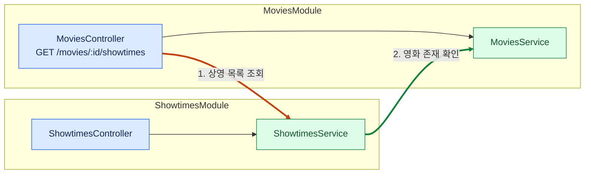
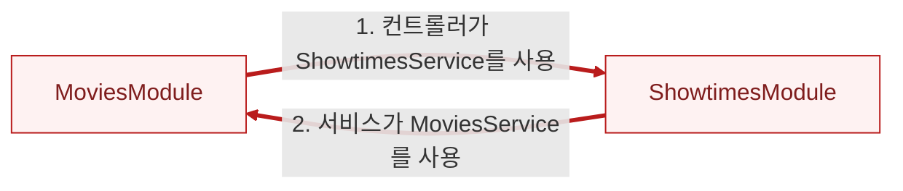
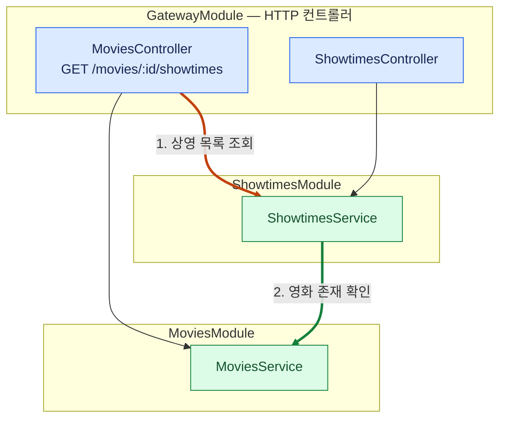
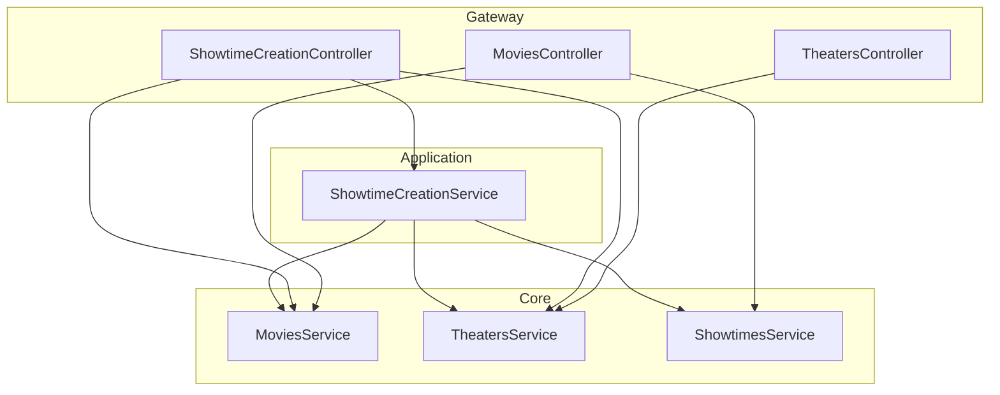

# NestJS로 구현한 SoLA

[English](README.md)

**SoLA(Service-oriented Layered Architecture)** 기반의 작은 NestJS 예제다.
서비스 간 협력을 상위 계층에서 조합해 각 서비스의 독립성을 유지한다.
영화의 상영시간을 생성하는 유스케이스 하나를 따라 구조를 살펴본다.

**SoLA 전체를 채택하지 않더라도 컨트롤러는 별도 계층으로 분리하자.**
컨트롤러는 리소스 중심 API와 유스케이스 중심 API에서 필요한 서비스를 조합하고,
Core 모듈은 자기 경계를 유지한다.

## 적용 전: 기능별 모듈에 컨트롤러와 서비스를 함께 배치

**서비스끼리는 순환하지 않아도, 그 서비스를 담은 모듈끼리는 순환할 수 있다.**
다음 두 요구사항을 보자.

1. `GET /movies/:id/showtimes`는 영화 정보와 상영 목록이 필요하므로,
   `MoviesController`가 두 서비스를 함께 사용한다.
2. 상영을 생성할 때 영화가 존재하는지 확인하므로,
   `ShowtimesService`가 `MoviesService`를 사용한다.

아래 큰 상자는 Nest 모듈이다. 파란 노드는 컨트롤러, 초록 노드는 서비스다.
번호를 붙인 화살표는 서로 다른 모듈에 있는 클래스를 연결한다.



서비스의 의존성은 `ShowtimesService → MoviesService` 한 방향뿐이다. 순환이 없다.
하지만 컨트롤러의 의존성도 그 컨트롤러가 속한 모듈의 import를 결정한다.
각 서비스가 자기 모듈에서 export된다면, 위의 두 화살표를 연결하기 위해
다음 [Nest 모듈 import](https://docs.nestjs.com/modules)가 필요하다.



**이 의존성과 모듈 등록을 그대로 유지하면 모듈 순환을 피할 수 없다.**
컨트롤러를 서비스와 함께 둔다고 언제나 순환하는 것은 아니다.
위의 두 모듈 간 참조가 함께 있어야 순환이 완성된다.
Nest도 순환을 피하라고 권고한다.
[`forwardRef()`](https://docs.nestjs.com/fundamentals/circular-dependency)는 순환 의존성을 해석하게 해주지만,
모듈 그래프의 순환 자체를 없애지는 않는다.

## 첫 단계: 컨트롤러만 분리

컨트롤러 등록을 HTTP 계층인 `GatewayModule`로 옮긴다.
첫 그림에 있던 네 개의 클래스 참조는 모두 그대로 둔다.



이제 1번 화살표에 필요한 import는 `GatewayModule → ShowtimesModule`이다.
`MoviesModule`은 더 이상 `ShowtimesModule`을 import하지 않으므로 순환이 끊어진다.
`GatewayModule`은 두 서비스 모듈을 import하고,
`ShowtimesModule → MoviesModule`은 여전히 한 방향으로만 이어진다.
같은 서비스와 API 요구사항을 유지하면서 해결한 것이다.

변경 대상은 `@Module({ controllers, imports, exports })`의 등록이다.
파일 위치만 옮겨서는 Nest 모듈 그래프가 바뀌지 않는다.

여기까지는 중간 설계 단계다. 실행 가능한 샘플은 아래 SoLA 규칙에 따라
Core 서비스 간의 협력도 Application으로 옮겨,
남아 있는 `ShowtimesModule → MoviesModule` 의존성까지 제거한다.

## 의존성 규칙

서비스는 하위 계층을 참조할 수 있다. 같은 계층의 서로 다른 모듈끼리는 참조하지 않으며,
둘의 협력은 상위 계층에서 조합한다. 이 규칙은 서비스와 타입 참조, Nest 모듈 import에 적용한다.

| 계층           | 책임                              | 참조할 수 있는 계층               |
| -------------- | --------------------------------- | --------------------------------- |
| Gateway        | HTTP 라우팅과 요청 변환           | Application, Core, Infrastructure |
| Application    | 여러 서비스를 조합하는 유스케이스 | Core, Infrastructure              |
| Core           | 한 도메인의 규칙과 데이터         | Infrastructure                    |
| Infrastructure | 결제·스토리지 등 외부 시스템 연동 | 외부 API                          |

Application·Core·Infrastructure는 SoLA의 서비스 분류다.
Gateway는 이 서비스를 사용하는 HTTP 진입점을 분리한다.
한 모듈 안의 클래스들은 서로 협력할 수 있다. 각 모듈은 서비스를 공개하고 데이터는 내부에 둔다.
이 유스케이스에는 외부 시스템 호출이 없어 Infrastructure 모듈을 만들지 않았다.

## 실행 가능한 샘플의 SoLA 구조

상영시간 생성 흐름은 기존 영화와 극장을 선택한 뒤 상영시간을 제출한다.
`/showtime-creation`은 이 작업에 필요한 엔드포인트를 묶고,
`ShowtimeCreationService`는 참여하는 Core 서비스를 조합한다.



화살표는 의존 방향이며, 모든 요청이 통과해야 하는 처리 순서는 아니다.
영화와 극장 생성은 각각 Core 하나를 직접 호출한다.
영화의 상영 목록은 Gateway에서 두 읽기 API를 조합한다.
상영 생성은 다른 도메인의 선행 조건 확인과 쓰기가 하나의 유스케이스를 이루므로 Application이 맡는다.

리소스 중심 URL이라고 해서 컨트롤러가 서비스 하나만 사용해야 하는 것은 아니다.
클라이언트가 수행하는 유스케이스에 맞춰 엔드포인트를 묶을 수도 있다.
두 URL 구성 모두 같은 의존성 규칙을 따른다.

[GatewayModule](src/gateway/gateway.module.ts)에서 Nest 모듈 연결을,
[MoviesController](src/gateway/movies.controller.ts)에서 HTTP 읽기 조합을,
[ShowtimeCreationService](src/application/showtime-creation/showtime-creation.service.ts)에서 유스케이스를 확인할 수 있다.
Core 모듈에는 컨트롤러가 없으며, Nest 모듈의 exports에는 서비스만 등록한다.

## 이 구조의 비용과 한계

서비스 조합이 필요한 곳에 모듈이 하나 더 생긴다.
단일 도메인 작업은 Gateway가 Core를 직접 호출하면 된다.
두 Application 서비스에 공통 동작이 필요하면 적절한 하위 경계로 추출하거나 책임을 다시 살펴본다.
같은 계층의 다른 모듈을 직접 참조하면 규칙을 위반한다.

이 샘플은 하나의 Nest 애플리케이션에서 실행한다.
프로세스 분리와 데이터 정합성에는 별도 설계가 필요하다.
모듈 그래프에 순환이 없다는 사실만으로 분산 트랜잭션이나 독립 배포가 보장되지는 않는다.

## Oxlint로 SoLA 경계 검사

[oxlint.config.mjs](oxlint.config.mjs)에서 Oxlint에 `eslint-plugin-boundaries`를 연결해
SoLA 의존성 규칙을 검사한다.

| 규칙                                        | lint가 거부하는 참조 예시                        |
| ------------------------------------------- | ------------------------------------------------ |
| 하위 계층만 참조                            | Core → Application 또는 Gateway                  |
| 같은 계층의 서로 다른 모듈 간 참조 금지     | `core/movies` → `core/showtimes`, 타입 참조 포함 |
| 다른 모듈의 공개 진입점인 `index.ts`만 사용 | Gateway → `core/movies/movies.service.ts`        |

한 모듈 안의 참조는 허용한다. Gateway는 모듈 하나로 취급하고,
Application·Core·Infrastructure 바로 아래의 각 디렉터리는 별도 모듈로 취급한다.
애플리케이션의 최상위 모듈 연결 코드는 이 서비스 경계 밖에 둔다.

import와 re-export, 타입 전용 참조, 인라인 `import()` 타입, `import = require()`를 검사한다.
모듈 내부에서는 자기 공개 진입점을 거치지 않고 구현 파일을 직접 가져온다.

```sh
npm run lint
npm run check
```

`lint`는 Oxlint와 포맷 검사를 실행하고, `check`는 TypeScript 컴파일까지 실행한다.
GitHub Actions는 Node.js 24와 26에서 `check`를 실행한다.
이 규칙은 import 그래프를 검사한다. 컨트롤러의 위치와 개별 메서드의 책임은 코드 리뷰로 확인한다.

## 실행

Node.js 24 이상이 필요하다.

```sh
npm ci
npm run build
npm start
```

API는 3000 포트에서 실행한다. 각 Core는 처음에 비어 있는 메모리 저장소를 소유한다.
프로세스가 종료되면 데이터는 사라진다.
아래 요청은 첫 두 요청에서 반환한 ID를 사용한다. 새 프로세스에서는 각각 `1`이다.

```sh
curl -i http://localhost:3000/movies \
  -H 'Content-Type: application/json' \
  -d '{"title":"A Trip to the Moon"}'

curl -i http://localhost:3000/theaters \
  -H 'Content-Type: application/json' \
  -d '{"name":"Screen 1"}'

curl -i http://localhost:3000/showtime-creation/movies
curl -i http://localhost:3000/showtime-creation/theaters

curl -i http://localhost:3000/showtime-creation \
  -H 'Content-Type: application/json' \
  -d '{"movieId":1,"theaterId":1,"startsAt":"2030-01-01T18:00:00Z"}'

curl -i http://localhost:3000/movies/1/showtimes
```

생성 요청은 `201`을 반환한다. 마지막 조회는 `200`과 함께 두 리소스를 반환한다.

```json
{
  "movie": { "id": 1, "title": "A Trip to the Moon" },
  "showtimes": [
    {
      "id": 1,
      "movieId": 1,
      "theaterId": 1,
      "startsAt": "2030-01-01T18:00:00.000Z"
    }
  ]
}
```

존재하지 않는 영화나 극장을 지정하면 상영을 생성하지 않고 `404`를 반환한다.
영화 제목이나 극장 이름이 비어 있거나, ID를 정수로 해석할 수 없거나,
날짜·시간 입력이 유효하지 않으면 `400`을 반환한다.
이 예제는 참조 확인과 생성까지 다룬다. 상영시간 충돌, 티켓 생성, 영속 저장소는 더 큰 예제에서 다룰 범위다.
