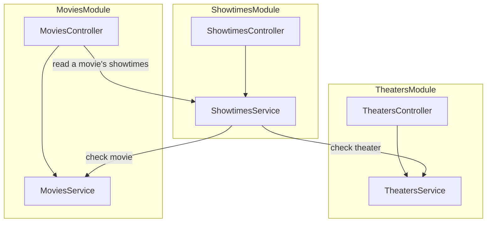
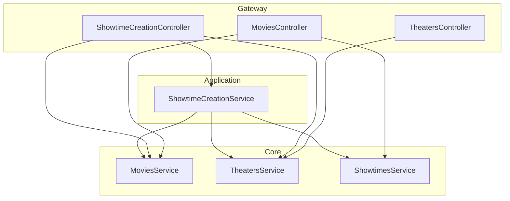

# SoLA with NestJS

[한국어](README.ko.md)

A small NestJS example of **Service-oriented Layered Architecture (SoLA)**: keep
services independent by composing their collaboration in a higher layer. The
example follows one use case, creating a movie showtime.

**Even without adopting all of SoLA, put controllers in a separate layer.**
Controllers can serve resource-oriented and use-case-oriented APIs using the
services each endpoint needs, while Core modules retain their own boundaries.

## Before: controllers and services in feature modules

Start with a design that applies neither SoLA nor controller separation. Each
feature module contains its controller and service, and services can call other
feature services directly.

An HTTP resource and a service boundary do not have to match one-to-one.
`MoviesController` uses both movie and showtime services to serve
`GET /movies/:id/showtimes`. Meanwhile, `ShowtimesService` checks the selected movie
and theater before creating a showtime.



These provider references require `MoviesModule` to import `ShowtimesModule`,
while `ShowtimesModule` imports `MoviesModule` and `TheatersModule`. The result is
the module cycle `MoviesModule → ShowtimesModule → MoviesModule`, even though
`MoviesService` does not inject `ShowtimesService`.

Using multiple services in a controller does not by itself create a cycle; the
reverse module dependency completes it. Moving controllers into a **Gateway
layer** removes HTTP composition from domain module imports. SoLA also moves the
collaboration between Core services into Application. Here, Gateway means HTTP
adapters.

Nest's [module imports and exports](https://docs.nestjs.com/modules) provide the
mechanism for these boundaries. SoLA supplies a rule for arranging them.

## The dependency rule

Services may depend on lower layers. Distinct modules in the same layer do not
depend on each other; their collaboration belongs in a higher layer. This rule
applies to service boundaries, including their types, as well as Nest module
imports.

| Layer          | Responsibility                               | May use                           |
| -------------- | -------------------------------------------- | --------------------------------- |
| Gateway        | HTTP routing and request conversion          | Application, Core, Infrastructure |
| Application    | A use case involving several services        | Core, Infrastructure              |
| Core           | One domain's rules and data                  | Infrastructure                    |
| Infrastructure | External systems such as payments or storage | External APIs                     |

Application, Core, and Infrastructure are the service categories in SoLA.
Gateway separates HTTP consumers from those services. Classes within a module can
collaborate normally. Each module exports its service; its data remains private.
This use case does not call an external system, so it has no Infrastructure module.

## After: controllers in Gateway, use cases in Application

The showtime creation flow selects an existing movie and theater, then submits a
showtime. `/showtime-creation` groups the endpoints for that task, and
`ShowtimeCreationService` coordinates the participating Core services.



The arrows show dependencies, not a pipeline that every request must traverse.
Movie and theater creation each use one Core directly. A movie's showtime list
combines two read APIs in Gateway. Creating a showtime uses Application because
checking cross-domain prerequisites and performing the write form a use case.

A resource-oriented URL does not require a controller to use exactly one service.
Likewise, an endpoint can be grouped by the use case its clients perform. Both URL
styles use the same dependency rule here.

Read [GatewayModule](src/gateway/gateway.module.ts) for the Nest wiring,
[MoviesController](src/gateway/movies.controller.ts) for HTTP read composition,
and [ShowtimeCreationService](src/application/showtime-creation/showtime-creation.service.ts)
for the use case. Core modules have no controllers and export only their service.

## What this arrangement costs

Composition introduces an additional module where services collaborate. For
single-domain operations, Gateway can call Core directly. If two Application
services need shared behavior, extract the behavior to an appropriate lower
boundary or reconsider their responsibilities; adding a peer dependency would
break the rule.

This sample runs the services in one Nest application. Process separation and
data consistency require their own design; an acyclic module graph does not
provide distributed transactions or independent deployment by itself.

## Check SoLA boundaries with Oxlint

[oxlint.config.mjs](oxlint.config.mjs) loads `eslint-plugin-boundaries` through
Oxlint to enforce the SoLA dependency rules:

| Rule                                                     | Example rejected by lint                          |
| -------------------------------------------------------- | ------------------------------------------------- |
| Reference lower layers only                              | Core → Application or Gateway                     |
| No references between distinct modules in the same layer | `core/movies` → `core/showtimes`, including types |
| Enter another module through its public `index.ts`       | Gateway → `core/movies/movies.service.ts`         |

References within a module are allowed. Gateway is one module; each direct child
directory of Application, Core, or Infrastructure is a separate module. The
composition root sits outside these service boundaries.

The checks cover imports, re-exports, type-only references, inline `import()`
types, and `import = require()`. Within a module, use implementation files
directly instead of importing its own public entry point.

```sh
npm run lint
npm run check
```

`lint` runs Oxlint and formatting checks; `check` also compiles TypeScript.
GitHub Actions runs `check` on Node.js 24 and 26. These rules validate the import
graph. Controller placement and the responsibilities of individual methods remain
part of code review.

## Run

Requires Node.js 24 or newer.

```sh
npm ci
npm run build
npm start
```

The API listens on port 3000. Each Core owns a private in-memory store, initially
empty. Data disappears when the process stops. The following requests use the IDs
returned by the first two requests (`1` each on a fresh process).

```sh
curl -i http://localhost:3000/movies \
  -H 'Content-Type: application/json' \
  -d '{"title":"A Trip to the Moon"}'

curl -i http://localhost:3000/theaters \
  -H 'Content-Type: application/json' \
  -d '{"name":"Screen 1"}'

curl -i http://localhost:3000/showtime-creation/movies
curl -i http://localhost:3000/showtime-creation/theaters

curl -i http://localhost:3000/showtime-creation \
  -H 'Content-Type: application/json' \
  -d '{"movieId":1,"theaterId":1,"startsAt":"2030-01-01T18:00:00Z"}'

curl -i http://localhost:3000/movies/1/showtimes
```

Creation returns `201`. The final request returns `200` with both resources:

```json
{
  "movie": { "id": 1, "title": "A Trip to the Moon" },
  "showtimes": [
    {
      "id": 1,
      "movieId": 1,
      "theaterId": 1,
      "startsAt": "2030-01-01T18:00:00.000Z"
    }
  ]
}
```

An unknown movie or theater returns `404` without creating a showtime. Empty
movie/theater names, invalid integer IDs, and invalid date-time input return
`400`. This teaching slice covers reference checks and creation; scheduling
conflicts, ticket generation, and persistent storage require a larger example.
