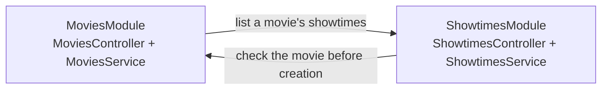
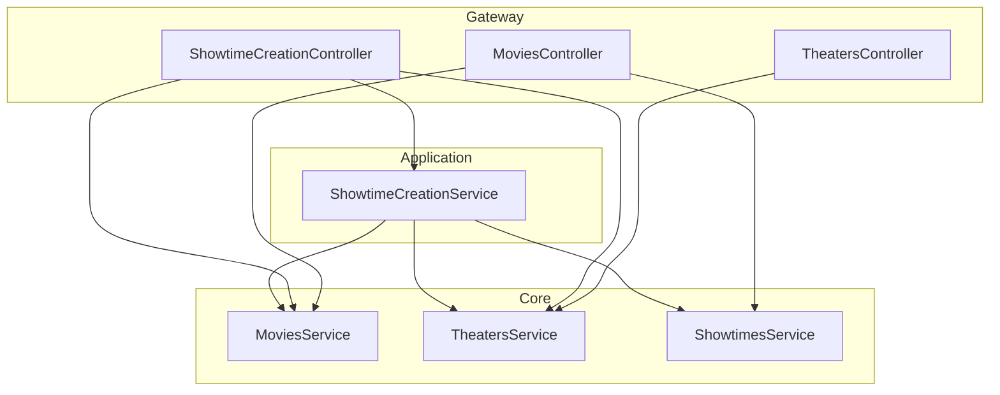

# SoLA with NestJS

A small NestJS example of **Service-oriented Layered Architecture (SoLA)**: keep
services independent by composing their collaboration in a higher layer. The
example follows one use case, creating a movie showtime.

**Even without adopting all of SoLA, put controllers in a separate layer.**
Controllers can serve resource-oriented and use-case-oriented APIs using the
services each endpoint needs, while Core modules retain their own boundaries.

## Why move controllers out of Core modules?

An HTTP resource and a service boundary do not have to match one-to-one. For
example, `GET /movies/:id/showtimes` needs both movie and showtime services. A
controller serving the showtime creation flow also needs to check the selected
movie and theater.

When each controller lives inside its Core module, those HTTP requirements become
dependencies of that entire module. The following arrangement introduces a cycle,
even if the Core services themselves do not inject each other:



Using multiple services in a controller does not by itself create a cycle. A cycle
appears when another dependency leads back to the originating module. Separating
controllers into a **Gateway layer** keeps HTTP composition from adding peer
dependencies to Core modules. In this example, Gateway means HTTP adapters.

Nest's [module imports and exports](https://docs.nestjs.com/modules) provide the
mechanism for these boundaries. SoLA supplies a rule for arranging them.

## The dependency rule

Services may depend on lower layers. Distinct modules in the same layer do not
depend on each other; their collaboration belongs in a higher layer. This rule
applies to service boundaries, including their types, as well as Nest module
imports.

| Layer          | Responsibility                               | May use                           |
| -------------- | -------------------------------------------- | --------------------------------- |
| Gateway        | HTTP routing and request conversion          | Application, Core, Infrastructure |
| Application    | A use case involving several services        | Core, Infrastructure              |
| Core           | One domain's rules and data                  | Infrastructure                    |
| Infrastructure | External systems such as payments or storage | External APIs                     |

Application, Core, and Infrastructure are the service categories in SoLA.
Gateway separates HTTP consumers from those services. Classes within a module can
collaborate normally. Each module exports its service; its data remains private.
This use case does not call an external system, so it has no Infrastructure module.

## From a use case to Nest modules

The showtime creation flow selects an existing movie and theater, then submits a
showtime. `/showtime-creation` groups the endpoints for that task, and
`ShowtimeCreationService` coordinates the participating Core services.



The arrows show dependencies, not a pipeline that every request must traverse.
Movie and theater creation each use one Core directly. A movie's showtime list
combines two read APIs in Gateway. Creating a showtime uses Application because
checking cross-domain prerequisites and performing the write form a use case.

A resource-oriented URL does not require a controller to use exactly one service.
Likewise, an endpoint can be grouped by the use case its clients perform. Both URL
styles use the same dependency rule here.

Read [GatewayModule](src/gateway/gateway.module.ts) for the Nest wiring,
[MoviesController](src/gateway/movies.controller.ts) for HTTP read composition,
and [ShowtimeCreationService](src/application/showtime-creation/showtime-creation.service.ts)
for the use case. Core modules have no controllers and export only their service.

## What this arrangement costs

Composition introduces an additional module where services collaborate. For
single-domain operations, Gateway can call Core directly. If two Application
services need shared behavior, extract the behavior to an appropriate lower
boundary or reconsider their responsibilities; adding a peer dependency would
break the rule.

This sample runs the services in one Nest application. Process separation and
data consistency require their own design; an acyclic module graph does not
provide distributed transactions or independent deployment by itself.

## Run

Requires Node.js 24 or newer.

```sh
npm ci
npm run build
npm start
```

The API listens on port 3000. Each Core owns a private in-memory store, initially
empty. Data disappears when the process stops. The following requests use the IDs
returned by the first two requests (`1` each on a fresh process).

```sh
curl -i http://localhost:3000/movies \
  -H 'Content-Type: application/json' \
  -d '{"title":"A Trip to the Moon"}'

curl -i http://localhost:3000/theaters \
  -H 'Content-Type: application/json' \
  -d '{"name":"Screen 1"}'

curl -i http://localhost:3000/showtime-creation/movies
curl -i http://localhost:3000/showtime-creation/theaters

curl -i http://localhost:3000/showtime-creation \
  -H 'Content-Type: application/json' \
  -d '{"movieId":1,"theaterId":1,"startsAt":"2030-01-01T18:00:00Z"}'

curl -i http://localhost:3000/movies/1/showtimes
```

Creation returns `201`. The final request returns `200` with both resources:

```json
{
  "movie": { "id": 1, "title": "A Trip to the Moon" },
  "showtimes": [
    {
      "id": 1,
      "movieId": 1,
      "theaterId": 1,
      "startsAt": "2030-01-01T18:00:00.000Z"
    }
  ]
}
```

An unknown movie or theater returns `404` without creating a showtime. Empty
movie/theater names, invalid integer IDs, and invalid date-time input return
`400`. This teaching slice covers reference checks and creation; scheduling
conflicts, ticket generation, and persistent storage require a larger example.

## Check the boundaries

```sh
npm run check
```

The check runs TypeScript, formatting, and import-boundary lint rules. Cross-module
imports must enter through the target module's `index.ts` and point to a lower
layer. Importing `core/showtimes` from `core/movies`, importing Gateway from Core,
or reaching directly into another module's implementation fails lint. Imports
inside a module use the implementation files directly, avoiding self-imports
through its own public entry point.

GitHub Actions runs these checks on Node.js 24 and 26. The rules examine static
imports; keeping business orchestration in Application remains a design decision.
